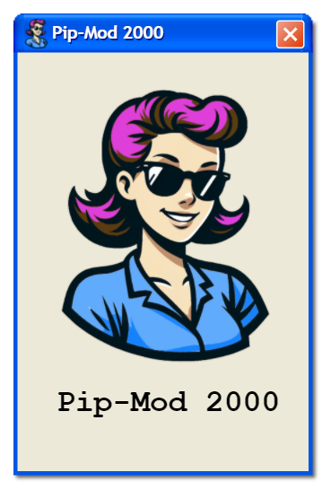

# Pip-Mod 2000 - Wireframes

For wireframes, we use [`pencil`](https://github.com/evolus/pencil).

## Installing

The latest official release of `pencil` is 3.1.1, and is available on
all platforms.

### Windows

`winget install Evolus.Pencil`

### MacOS

`brew install pencil`

### Linux

`sudo apt install pencil`

Pencil is also available on Arch Linux via the AUR.

### Development Version

At the time of writing, the latest version (`development` branch)
of `pencil` is 3.1.2
and there are no officially available pre-build binaries or installers.

I built the development version for Windows, Mac, and Linux.

The installers are available here:

- https://github.com/PipMod2000/Resources/releases/tag/pencil-3.1.2

## Stencils

There are lots of incredible third-party "stencils" for pencil
for defining wireframes.

I have collected a few of them here:

- https://github.com/PipMod2000/Resources/releases/tag/pencil-3.1.2

We may use any of the stencils available in the above link:

- Font Awesome
- Material
- Bootstrap
- Protheus
- Dojo
- ExtJS
- _or any of the stencils which are shipped along with Pencil_

If you use a stencil that is not in the above link, please share it with the team and we will add it to the `release` linked above.

# LICENSE

> `Copyright © Mrowr Purr`
>
> Wireframes are **not open source** and **not** covered by Pip-Mod 2000's `0BSD` license.
>
> You **may not** use, copy, or distribute the wireframes without explicit permission from the author.
>
> _This may seem silly, but the stencils used may have various licenses and_
> _I simply want to avoid any possible licensing disputes._
